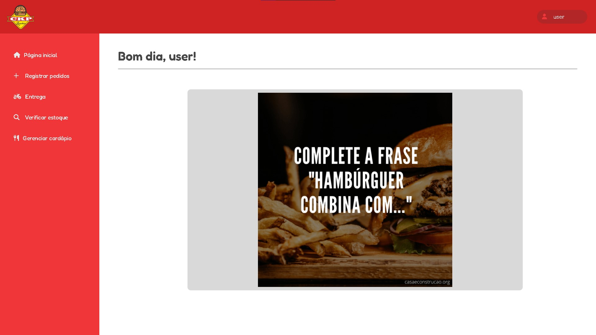
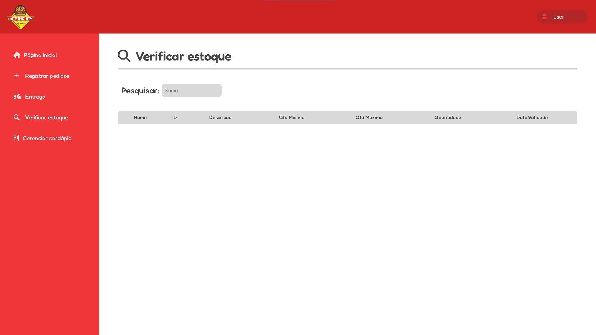
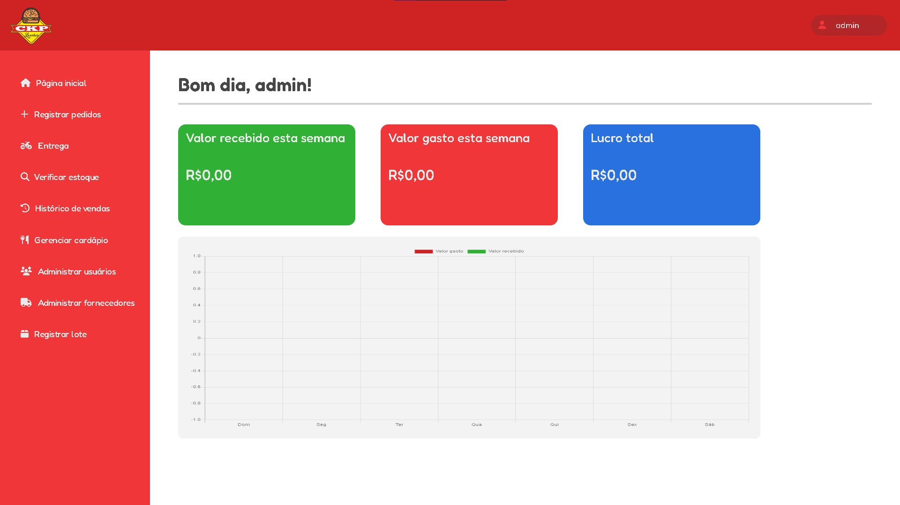
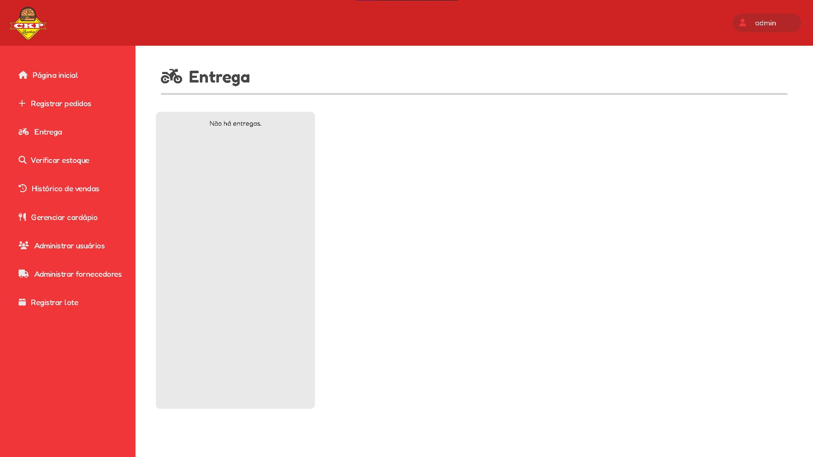

# CKP Lanches

## Screenshots

### Tela de Login


### **Telas de Usuário**
As telas para usuários comuns, que possuem permissões limitadas, incluem funcionalidades como consulta ao estoque e registro de vendas.

### Tela Principal Usuário


### Tela de Pedidos


### Tela de Entregas


### Tela de Estoque


### Tela de Cardápio


### **Telas de Administrador**
As telas para administradores, que possuem permissões totais, incluem funcionalidades como gerenciamento completo de estoque, geração de relatórios e análise de desempenho financeiro.

### Tela Principal Administrador


### Tela de Pedidos


### Tela de Entregas


### Tela de Estoque


### Tela de Histórico de Vendas


### Tela de Cardápio


### Tela de Administrar Usuários


### Tela de Fornecedores


### Tela de Lotes


## Como Executar o Projeto

### Pré-requisitos
- **Java 21** ou superior
- **Maven** para construir o projeto
- **MySQL** ou outro banco de dados compatível configurado

### Instalação

1. **Clone o repositório**:
    ```bash
    git clone https://github.com/LuisGustavoDev/TCCckpLanches.git
    ```

2. **Navegue até o diretório do projeto**:
    ```bash
    cd TCCckpLanches
    ```

3. **Criação do Banco de Dados**:
    - Antes de iniciar o projeto, é necessário criar o banco de dados `ckp_lanches` no MySQL.
    - Execute o seguinte comando no MySQL para criar o banco de dados:
      ```sql
      CREATE DATABASE ckp_lanches;
      ```

4. **Configure o banco de dados MySQL**:
    - Certifique-se de que as credenciais de acesso (usuário e senha) no arquivo `application.properties` estão corretas.
    - Aqui estão as configurações que você deve ajustar, se necessário:

    ```properties
    # Configurações do Banco de Dados
    spring.datasource.url=jdbc:mysql://localhost:3306/ckp_lanches?useTimezone=true&serverTimezone=UTC
    spring.datasource.username=root
    spring.datasource.password=1234
    ```

5. **Configuração do `application.properties`**:
    O arquivo `application.properties` contém as configurações do projeto, como banco de dados, credenciais de acesso e configurações do JWT. Aqui estão algumas das propriedades que você precisa garantir que estão corretamente configuradas:

    ```properties
    # Configurações do Banco de Dados
    spring.datasource.url=jdbc:mysql://localhost:3306/ckp_lanches?useTimezone=true&serverTimezone=UTC
    spring.datasource.username=root
    spring.datasource.password=1234

    # Configurações do JPA (Hibernate)
    spring.jpa.hibernate.ddl-auto=none  # Define o comportamento de criação de banco de dados
    spring.jpa.show-sql=true  # Exibe as consultas SQL no console

    # Inicialização do Banco de Dados
    spring.datasource.initialization-mode=true
    spring.sql.init.mode=always

    # Configurações de Segurança JWT
    my-auth-secret-key=${JWT_SECRET:3dd97dc69115959749508d438d53e9ee}  # Chave secreta para autenticação JWT
    ```

    **Importante**: Substitua `root` e `1234` pelo seu nome de usuário e senha de banco de dados. A chave `JWT_SECRET` é usada para gerar tokens JWT e deve ser mantida secreta.

6. **Dependências**:
    O projeto utiliza as seguintes dependências essenciais:

    - **Spring Boot** (Starter Data JPA, Security, Web)
    - **MySQL Connector**: Para a conexão com o banco de dados MySQL
    - **Lombok**: Para reduzir boilerplate no código
    - **Spring Security**: Para autenticação e autorização
    - **JWT** (Java JWT): Para geração de tokens JWT
    - **Spring Boot DevTools**: Para facilitar o desenvolvimento

    As dependências estão definidas no arquivo `pom.xml` do Maven.

### Rodando o Projeto

Para rodar o projeto, execute o seguinte comando no terminal:

```bash
mvn spring-boot:run
```